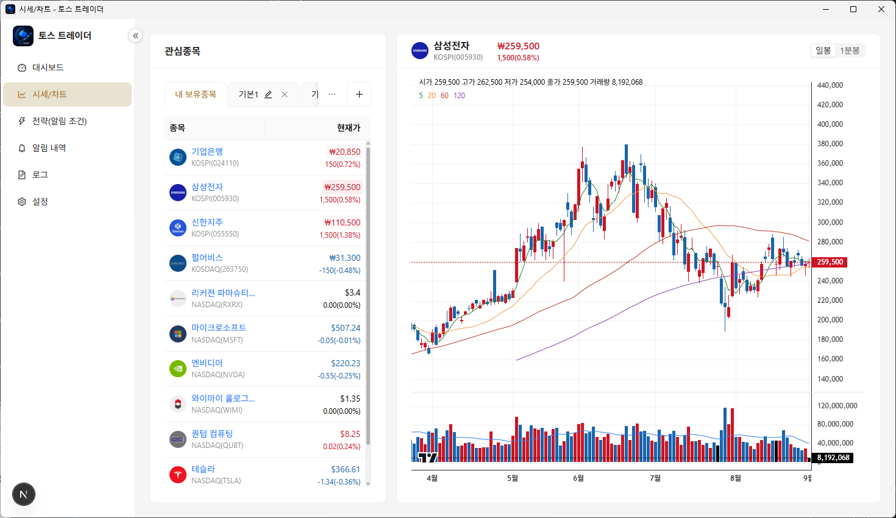
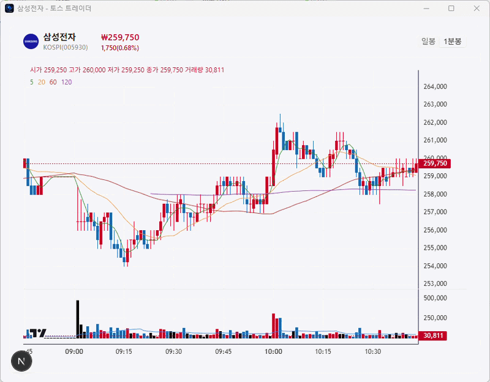
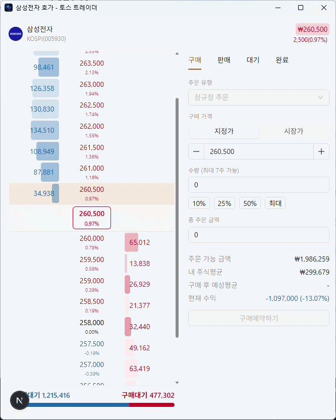

# 토스 트레이더 (Toss Trader)



토스증권 Open API를 이용해, 내가 정한 매매 전략 조건이 충족될 때 알림을 받기 위해 만든
**개인용 데스크톱 프로그램**입니다. Electron 기반이라 Windows/macOS에서 독립 실행 파일로
동작하며, 백그라운드에서 시세를 계속 감시하다가 조건이 맞으면 데스크톱 알림을 띄웁니다.

> ⚠️ 개인 용도로 만든 프로젝트라 토스증권 Open API 이용 약관, 개인 크리덴셜, 계좌 정보에
> 강하게 의존합니다. 그대로 포크해서 쓰기보다는 구조를 참고하는 용도로 봐주세요.

## 지금 이 프로젝트가 하는 일 / 하지 않는 일

- **한다**: 계좌·보유종목·시세 조회, 관심종목 관리, 실시간 캔들차트, 사용자가 등록한 전략
  조건(예: 목표가 도달)을 30초 주기로 평가해서 **데스크톱 알림 + 인앱 알림**을 띄우는 것.
  호가창 팝업의 매매지원 패널에서 **수동으로 매수/매도 주문을 직접 접수/정정/취소**하고, 그
  주문이 체결되면(전량/부분) 계좌 단위 WebSocket(`personal:order`)으로 실시간 알림을 받는 것까지.
- **안 한다**: 전략 신호를 보고 자동으로 주문을 넣는 것(자동매매), 조건주문(OCO/OTO) 연동. 이
  둘은 아직 다음 단계로 미뤄둔 기능입니다.

> ⚠️ 토스증권 Open API는 모의투자/샌드박스 환경이 없습니다. 매매지원 패널에서 주문을 접수하면
> **클릭 즉시 실계좌에 반영**됩니다(제출 전 확인 모달은 뜨지만, 별도의 dry-run 모드는 없습니다).

설계 배경과 전체 로드맵은 [`docs/PLAN.md`](docs/PLAN.md)에 더 자세히 정리되어 있습니다(현재
코드와 100% 동기화된 문서는 아니라서, 실제 동작은 코드 기준으로 봐주세요).

## 주요 기능

- **대시보드**: 코스피/코스닥/원-달러 환율 지수 배너 + 보유 종목 표 + 거래대금/거래량/급등락 등
  종목 랭킹 카드. 국내장이 열려 있을 평일 08~20시(KST)에는 30초마다 자동으로 새로고침됩니다.
- **시세/차트**: 관심종목(그룹별 탭) 관리 + 실시간 캔들차트(일봉/1분봉, 이동평균선, 거래량)

  

- **종목 팝업 창**: 랭킹이나 보유종목을 클릭하면 별도 창으로 실시간 차트가 뜨고, 메인
  창에 가까이 끌어다 놓으면 자석처럼 붙어서 메인 창을 움직이거나 크기를 바꿀 때 같이
  따라옵니다.
- **호가창 & 매매지원**: 종목별 실시간 호가창 팝업. 설정에서 매매지원을 켜면 옆에 매수/매도
  패널이 붙어 실제 주문을 접수/조회/정정/취소할 수 있고, 체결되면 데스크톱 알림 + 인앱
  토스트로 알려줍니다. 대기 탭에서 대기 중 주문을 정정(바텀시트, KR은 가격+수량·US는 가격만)
  하거나 취소(재확인 후)할 수 있고, 완료 탭에서 종목별 매매 이력을 조회합니다.

  
- **전략(알림 조건)**: 조건을 등록/수정/on-off 하면 전략 엔진이 시세를 주기적으로 평가
- **알림 내역**: 발생한 신호를 이력으로 조회
- **로그**: API 호출/에러 등 시스템 로그 조회
- **설정**: Open API `client_id`/`client_secret` 등록(연결 테스트 후 암호화 저장, 저장 성공 시
  앱 자동 재시작) + 매매지원 on/off + 종목 마스터 캐시 상태 조회/수동 재동기화 + 테스트 알림 발송

## 기술 스택 & 패키지 구성

> 🤖 이 프로젝트는 초기 설계를 제외한 대부분의 코드를 [Claude Code](https://claude.com/claude-code)로 작성했습니다.
> 클로드가 해결하지 못한 이슈는 크게 다섯 가지였고, 그 부분만 직접 수정·구현했습니다.

Electron(데스크톱 셸) 위에 Next.js(화면) 를 얹은 [Nextron](https://github.com/saltyshiomix/nextron)
구조입니다. `main/`(Node.js, Electron 메인 프로세스)와 `renderer/`(Next.js, 순수 UI)가 IPC로만
통신하고, 서로의 런타임 코드를 직접 import하지 않습니다.

### 런타임 의존성 (`dependencies`)

| 패키지                             | 역할                                                                             |
| ---------------------------------- | -------------------------------------------------------------------------------- |
| `electron-serve`, `electron-store` | 프로덕션 빌드에서 정적 리소스 서빙 / 창 크기·위치 같은 앱 상태 저장              |
| `kysely`                           | Node 내장 `node:sqlite` 위에 얹는 타입 세이프 SQL 쿼리 빌더 — 별도 ORM 없이 사용 |
| `ws`                               | 토스증권 실시간 시세 WebSocket 클라이언트                                        |
| `pino`, `pino-pretty`              | 구조화 로깅(개발 중엔 pretty 출력)                                               |
| `antd`, `@ant-design/icons`        | 화면 UI 컴포넌트(테이블·폼·차트 주변 UI 등)                                      |
| `lightweight-charts`               | TradingView의 경량 캔들차트 라이브러리 — 시세/차트 화면의 실제 차트 렌더링 담당  |
| `zustand`                          | 가벼운 전역 상태(현재 선택된 종목 등 화면 간 공유가 필요한 최소한의 상태만)      |
| `dotenv`                           | `.env`에 넣어둔 API 크리덴셜/설정을 로드                                         |

### 개발 의존성 (`devDependencies`)

| 패키지                                                      | 역할                                                                     |
| ----------------------------------------------------------- | ------------------------------------------------------------------------ |
| `electron`, `electron-builder`                              | 데스크톱 앱 실행/패키징(설치 파일 빌드)                                  |
| `next`, `nextron`                                           | 화면(Next.js) 개발 서버 + Electron과 묶어서 개발/빌드하는 오케스트레이션 |
| `typescript`, `typescript-eslint`                           | 정적 타입 검사, 타입 인지 린트 규칙                                      |
| `eslint`, `eslint-config-next`, `eslint-plugin-react-hooks` | 코드 품질 검사(Hooks 의존성 배열 오류 등도 여기서 잡음)                  |
| `prettier`                                                  | 코드 포맷터                                                              |
| `sass`                                                      | 전역 스타일시트(`renderer/styles/globals.scss`) 컴파일                   |
| `react`, `react-dom`, `@types/*`                            | UI 렌더링 및 타입 정의                                                   |

### DB / API 관련 설계 요점

- **DB**: Node 내장 `node:sqlite`(`DatabaseSync`) + Kysely. 네이티브 바인딩(`better-sqlite3` 등)을
  쓰지 않아 배포 시 네이티브 모듈 재빌드 이슈가 없습니다. 스키마 변경은 `main/db/migrations.ts`에
  버전을 append하는 방식(이미 적용된 마이그레이션은 절대 수정하지 않음).
- **토스증권 API 클라이언트** (`main/toss-api/`): OAuth2 클라이언트 크리덴셜 토큰 발급/캐시,
  API 그룹별 레이트리미터(토큰 버킷), 401 재시도/429 백오프를 갖춘 공통 HTTP 클라이언트 위에
  계좌/시세/종목/랭킹/주문 엔드포인트 래퍼를 올린 구조입니다. 주문은 수량 지정 생성/정정/취소
  (`POST /orders`, `/orders/{id}/modify|cancel`)를 지원하며, 조건주문은 아직 호출하지 않습니다.
  정정은 KR이 가격+수량(수량 필수), US가 가격만 지원하는 등 시장별 규칙이 달라 UI(정정
  바텀시트)도 그에 맞춰 필드를 다르게 보여줍니다. WebSocket 클라이언트는
  시세(`trade`)·호가(`orderbook`) 채널 외에 계좌 단위 주문 체결 채널(`personal:order`)도
  항상 구독해 체결 시 알림을 띄웁니다.
- **전략 엔진** (`main/engine/`): 30초 주기로 활성 전략을 평가하고, 조건 충족 시 신호를 기록 +
  알림(쿨다운 적용)을 발생시킵니다. `STRATEGY_REGISTRY`에 모듈을 등록하는 방식이라 새 전략
  유형 추가가 쉽습니다(현재는 목표가 도달 전략만 구현).

## 프로젝트 구조

```
main/                     Electron 메인 프로세스 (Node.js, TypeScript)
├─ toss-api/              토스증권 Open API 클라이언트(인증, 레이트리밋, 엔드포인트별 래퍼, WS)
├─ db/                    SQLite 연결/마이그레이션/스키마 + 테이블별 repository
├─ engine/                전략 스케줄러 + 전략 유형별 평가 모듈
├─ ipc/                   IPC 채널 정의 및 핸들러 등록
├─ notify/                데스크톱/인앱 알림 발신
├─ helpers/               창 생성, 창 스냅(자석 도킹) 등 Electron 창 관련 유틸
└─ main.ts, preload.ts    앱 진입점, contextBridge로 renderer에 노출할 API 정의

renderer/                 Next.js 화면 (순수 UI, main 프로세스 코드를 import하지 않음)
├─ pages/                 사이드바 메뉴에 대응하는 화면들(대시보드/시세/전략/알림내역/로그/설정)
├─ components/            화면 간 재사용 컴포넌트(차트 카드, 랭킹 카드, 관심종목 패널 등)
├─ hooks/, lib/, store/   커스텀 훅, IPC 래퍼/포맷터 등 유틸, 최소한의 전역 상태

docs/                     설계 기획서, API 문서, 차트 기능 로드맵
```

## 시작하기

### 1. 의존성 설치

```bash
npm install
```

### 2. 환경 변수 설정

`.env.example`을 복사해 `.env`를 만들고, 토스증권 WTS 로그인 → 설정 > Open API 메뉴에서
발급받은 크리덴셜을 채워 넣습니다.

```bash
cp .env.example .env
```

```env
TOSS_CLIENT_ID=
TOSS_CLIENT_SECRET=
TOSS_API_BASE_URL=https://openapi.tossinvest.com
TOSS_WS_URL=wss://openapi-ws.tossinvest.com/ws/v1
LOG_LEVEL=info
DB_PATH=
```

크리덴셜이 없어도 UI 자체는 뜨지만, 전략 엔진/시세 연동/종목 마스터 동기화는 동작하지 않습니다.
또한 **설정 > Open API > 허용 IP 관리**에 호출 IP를 등록해두지 않으면 API가 403으로 거부됩니다.

### 3. 실행

```bash
npm run dev      # 개발 모드 (핫 리로드)
npm run build    # 프로덕션 빌드(설치 파일 생성)
npm run lint     # ESLint
npm run format   # Prettier
```

## Contributing

피드백을 환영합니다. 제안·버그 제보:

- 이메일 [tom@xingxing.kr](mailto:tom@xingxing.kr)

## 라이선스

MIT
